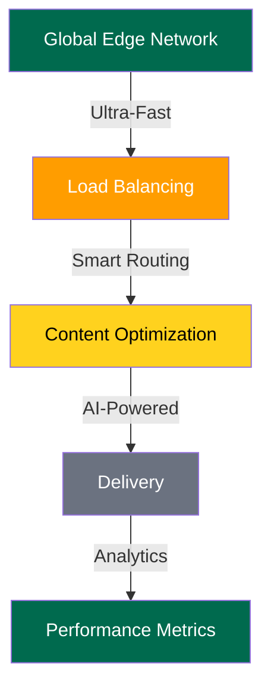
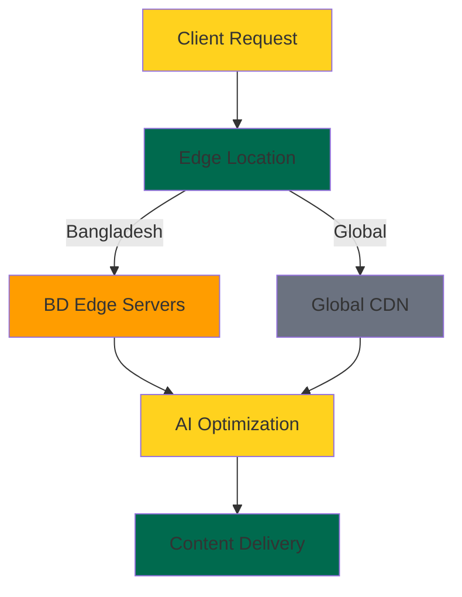

# VΔOS Platform 🚀


**Empowering Digital Bangladesh with Lightning-Fast Content Delivery & AI Innovation**

[](https://digitalbangladesh.gov.bd)
[](https://deepseek.ai)
[](https://huggingface.co)
[](https://v4os.org)
[](https://github.com/v4os)

<div align="center">
  <h3>Part of Bangladesh's Digital Innovation Revolution</h3>
  <p>🌐 <a href="http://chat.v4os.org">chat.v4os.org</a> | 📧 <a href="mailto:services@v4os.org">services@v4os.org</a></p>
  <p>Powered by:</p>
  <a href="https://huggingface.co"></a>
  <a href="https://deepseek.ai"></a>
</div>

---

## 🎯 Vision & Innovation

VΔOS (Value Apex Operating System) is at the forefront of Bangladesh's technological revolution, providing enterprise-grade CDN services and AI-powered solutions. We're transforming content delivery with cutting-edge AI integration, born in the heart of Digital Bangladesh.

---

## 🌟 Core Technologies

### Content Delivery Excellence



### Performance Metrics

| **Metric** | **Performance** |
|------------|------------------|
| Global Response Time | < 50ms |
| Availability | 99.99% |
| Edge Points | 150+ |
| Bandwidth | Unlimited |
| SSL/TLS | Auto-managed |

---

## 💫 Advanced Features

### AI-Powered CDN Configuration

```typescript
interface CDNConfig {
  region: 'bd-dhaka' | 'bd-ctg' | 'global';
  optimization: {
    ai: boolean;
    compression: 'auto' | 'aggressive' | 'balanced';
    caching: CachingStrategy;
  };
  security: SecurityConfig;
}

// Example Usage
const config: CDNConfig = {
  region: 'bd-dhaka',
  optimization: {
    ai: true,
    compression: 'auto',
    caching: {
      strategy: 'intelligent',
      ttl: 'adaptive'
    }
  },
  security: {
    ddos: 'advanced',
    ssl: 'managed',
    firewall: 'smart'
  }
};
```

---

## 🏗 Architecture



---

## 🚀 Digital Bangladesh Integration

- **Local Edge Points**: Strategic server locations in Dhaka, Chittagong, and Sylhet
- **Smart Routing**: AI-powered traffic optimization for Bangladesh users
- **Digital Payment**: Integration with bKash, Nagad, and other local payment systems
- **Bangla Language Support**: Full Unicode compliance for Bangla content

---

## 💻 Development Quick Start

```bash
# Install dependencies
bun install

# Start local development
bun run dev

# Build for production
bun run build

# Deploy to BD edge network
bun run deploy:bd
```

---

## 🌟 DeepSeek-V3 Capabilities

```yaml
DeepSeek-V3 achieves a significant breakthrough in inference speed over previous models.
It tops the leaderboard among open-source models and rivals the most advanced closed-source models globally.
```

---

## 🔒 Enterprise Features

- **Advanced DDoS Protection**: ML-powered threat detection
- **Smart Caching**: AI-optimized content caching
- **Real-time Analytics**: Detailed insights dashboard
- **Custom SSL**: Managed SSL certificate deployment
- **24/7 Support**: Bangladesh-based technical support team

---

## 🤝 Community & Support

- **Documentation**: [docs.v4os.org](https://docs.v4os.org)
- **Community**: [Join our Discord](https://discord.gg/v4os)
- **Support**: [services@v4os.org](mailto:services@v4os.org)
- **Blog**: [blog.v4os.org](https://blog.v4os.org)

---

## 🎨 Brand Colors

```css
/* VΔOS Brand Colors */
--primary: #FFD21E;    /* Innovation Gold */
--secondary: #FF9D00;  /* Energy Orange */
--neutral: #6B7280;    /* Professional Gray */
--bd-green: #006A4E;   /* Bangladesh Green */
```

---

## 🤝 Contributing

We welcome contributions from Bangladesh's growing developer community! See our [Contributing Guide](CONTRIBUTING.md).

---

## 📜 License

This project is licensed under the MIT License. See the [LICENSE](LICENSE) file for details.

---

<div align="center">

**VΔOS - Empowering Digital Bangladesh's Future**

Created with ❤️ by [Likhon Sheikh](https://likhonsheikh.com/)

© 2025 VΔOS (Value Apex Operating System), Inc. All rights reserved.

</div>

---
